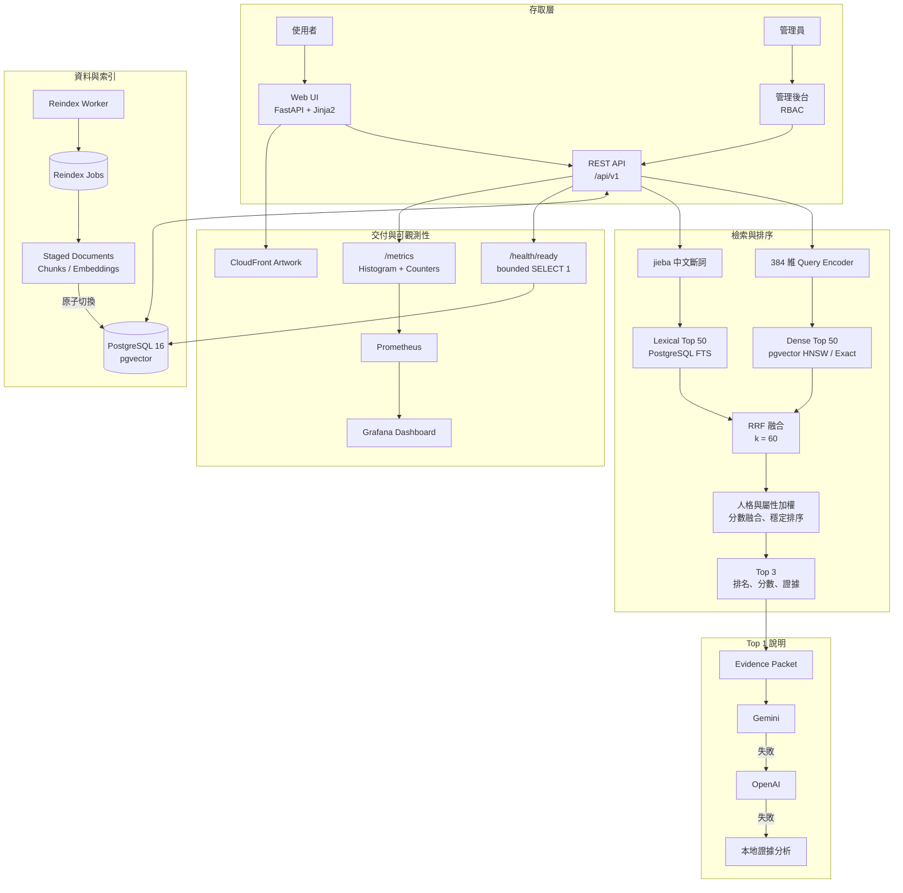

<div align="center">

# Pokémon Personality Recommender

**以 Hybrid Retrieval 與 Grounded RAG，從 1,025 隻寶可夢中找出最契合的性格夥伴。**

輸入個性、興趣或生活方式描述，系統會結合語意檢索、中文全文搜尋、人格詞庫與寶可夢屬性權重，回傳穩定排序的 Top 3，並以可追蹤的圖鑑證據產生繁體中文分析。

[](https://github.com/likaisuwork9616/pokemon-personality-recommender/actions/workflows/ci.yml)


[快速開始](#快速開始) · [API](#api-使用方式) · [系統架構](#系統架構) · [測試與評估](#測試與評估) · [下一階段](#現況限制與下一階段目標)

</div>

> [!NOTE]
> 本專案為非官方、非商業的教育與作品集專案，不屬於心理診斷工具，也與 Nintendo、Creatures Inc.、GAME FREAK Inc. 或 The Pokémon Company 無官方關聯。

---

## 專案簡介

一般的語意推薦只會告訴使用者「哪個結果最相似」，卻不一定能說明推薦依據。本專案將推薦排名與文字生成分開處理：

1. **檢索與評分系統**決定 Top 3 寶可夢、分數與證據。
2. **LLM**只負責根據既有排名與證據整理說明，不能改寫名次或分數。
3. 外部模型無法使用時，系統仍可透過本地 evidence-only fallback 完成推薦。

目前以本機 Docker Compose 作為完整展示環境。Web 首頁聚焦 Top 1，Top 2／3 以精簡卡片供比較；REST API 固定回傳完整 Top 3 與各項分數。

---

## 核心特色

- **自然語言人格推薦**：輸入個性、興趣或生活習慣，取得可重現的 Top 3 排名。
- **Hybrid Retrieval**：結合 pgvector Dense Retrieval、jieba 中文斷詞、PostgreSQL Full Text Search 與 RRF。
- **可量測的重排實驗**：內建多語 Cross-Encoder A/B 工具、品質門檻與延遲預算；目前 CPU 實測未達門檻，因此預設關閉。
- **Grounded RAG**：LLM 只能使用當次 evidence allowlist，所有說明均可追溯至圖鑑文件與 chunk。
- **可解釋分數**：每筆結果提供 `semantic`、`personality` 與 `total` 分數。
- **資料庫化人格規則**：16 維人格特質、繁中／英文同義詞與權重保存在 PostgreSQL，可由管理端即時更新。
- **屬性參考權重**：18 種寶可夢屬性的主、副屬性權重會納入人格計分。
- **RBAC 管理後台**：`viewer / editor / admin` 分權，支援寶可夢與人格詞庫維護、reindex、可追蹤 Audit Log。
- **安全的索引更新**：新版 documents、chunks 與 embeddings 全部 ready 後，才原子切換 current index。
- **多層 AI 備援**：Gemini → OpenAI → 本地證據分析；任何 LLM 失敗都不影響原始排名。
- **可重現環境**：Alembic、Docker Compose、seed、embedding worker、CI 與測試均納入專案。
- **即時 Readiness**：每次 `/health/ready` 都以 bounded `SELECT 1` 驗證 PostgreSQL，並與 liveness 分離。

---

## 系統架構



CSV 只在空資料庫初始化時作為 seed 來源。服務啟動後，寶可夢資料、人格詞庫、知識 chunks、索引狀態、Audit Log 與 embeddings 均直接由 PostgreSQL 讀取。Cross-Encoder 位於分數融合後的選配實驗路徑；因目前 CPU benchmark 未通過品質與延遲門檻，主流程預設不啟用。

---

## 推薦流程

1. FastAPI 驗證 request schema 與輸入長度。
2. SentenceTransformer 將描述轉成正規化的 384 維 query vector。
3. pgvector Dense Retrieval 與中文全文搜尋各取 Top 50 chunks。
4. 系統以 RRF（`k=60`）融合 Dense／Lexical 排名。
5. 結果按寶可夢聚合，每隻最多保留三段證據，避免 chunk 數量造成灌票。
6. SQL 人格詞庫將描述映射成 16 維人格訊號，再加入主、副屬性參考權重。
7. 系統以寶可夢 ID 作最終 tie-break，產生可重現的 Top 3。
8. 只有 Top 1 會進入 Grounded RAG；Gemini、OpenAI 與本地 fallback 都不能改變排名與分數。

### 分數融合

```text
total = α × personality + (1 - α) × semantic
```

`α` 會依辨識到的人格訊號調整，範圍為 `0.35–0.80`。

每段推薦證據均保存：

```text
document_id
chunk_id
content_hash
evidence_id
```

因此可以追溯到當次使用的知識版本，而不是只顯示無法驗證的 AI 結論。

### Grounded RAG 與備援

- Web 介面預設要求 Top 1 契合分析。
- API 的 `generate_explanation` 預設為 `false`，由呼叫端決定是否啟用外部分析。
- 有 `GEMINI_API_KEY` 時優先使用 Gemini。
- Gemini 缺少 key、逾時、格式錯誤、非繁中或引用不合法時，才嘗試 OpenAI。
- 兩個外部服務都不可用時，改由本地人格訊號、屬性權重與圖鑑證據產生繁中說明。
- LLM 回應必須符合結構化 schema，且只能引用該推薦結果自己的 evidence allowlist。
- OpenAI 請求明確設定 `store=false`。
- 模型錯誤、prompt 與原始個性描述不寫入應用程式 log。

---

## 技術棧

| 類別 | 技術 |
| --- | --- |
| Web／API | FastAPI、Pydantic、Jinja2、原生 JavaScript／CSS |
| Database | PostgreSQL 16、SQLAlchemy、Alembic |
| Retrieval | pgvector、HNSW、Exact Cosine Search、PostgreSQL FTS、jieba、RRF、選配 Cross-Encoder |
| Embedding | SentenceTransformers `paraphrase-multilingual-MiniLM-L12-v2` |
| RAG | Google Gemini、OpenAI、結構化輸出、Citation Allowlist |
| Operations | Docker Compose、背景 Reindex Worker、Prometheus 3.14、Grafana 13.2 |
| Media Pipeline | Amazon S3、CloudFront、SHA-256 Manifest 驗證 |
| Quality | unittest、GitHub Actions、20 題三級相關性離線評估、向量效能基準 |

---

## 快速開始

### 執行需求

- Docker Desktop
- Docker Compose v2
- 約 4 GB 可用記憶體
- 首次啟動時可連線下載 Python packages 與 Hugging Face embedding model
- Gemini／OpenAI API key 為選配；沒有 key 仍可使用完整排名與本地契合分析

### 1. 取得專案

```bash
git clone https://github.com/likaisuwork9616/pokemon-personality-recommender.git
cd pokemon-personality-recommender
```

建立環境檔：

```bash
cp .env.example .env
```

Windows PowerShell：

```powershell
Copy-Item .env.example .env
```

### 2. 設定必要環境變數

至少設定 PostgreSQL 密碼。要啟用管理後台時，另設定管理密碼與至少 32 字元的 session secret：

```env
POSTGRES_PASSWORD=replace-with-a-strong-password

ADMIN_PASSWORD=replace-with-a-strong-admin-password
ADMIN_SESSION_SECRET=replace-with-a-random-secret-of-at-least-32-characters
ADMIN_COOKIE_SECURE=false
```

`ADMIN_PASSWORD` 會建立向下相容的 `admin` 帳號。若需要多帳號分權，可再設定 JSON；不要把真實密碼提交到 repository：

```env
ADMIN_ACCOUNTS_JSON=[{"username":"reader","password":"replace-viewer-password","role":"viewer"},{"username":"editor","password":"replace-editor-password","role":"editor"}]
```

外部契合分析為選配。兩個 provider 都有設定時，固定以 Gemini 為第一順位：

```env
GEMINI_API_KEY=
GEMINI_MODEL=gemini-3.5-flash-lite

OPENAI_API_KEY=
OPENAI_MODEL=gpt-5-mini
```

> [!WARNING]
> `.env` 已由 Git 排除。請勿將資料庫密碼、管理密碼或 API key 寫入 repository。

### 3. 啟動服務

```bash
docker compose up --build -d
docker compose ps -a
```

第一次啟動會依序執行：

```text
Alembic Migration → 匯入 1,025 筆 Seed 資料 → 建立 Embeddings → 啟動 API 與 Worker
```

`migrate`、`seed`、`embed` 成功後會顯示 `Exited (0)`；`db`、`api`、`worker` 會持續運行。

| 功能 | URL |
| --- | --- |
| 人格推薦 | <http://localhost:8000/> |
| 寶可夢圖鑑 | <http://localhost:8000/pokemon> |
| Prometheus | <http://localhost:9090> |
| Grafana | <http://localhost:3000> |

Grafana 預設帳號為 `admin`；啟動前請在 `.env` 設定自己的 `GRAFANA_ADMIN_PASSWORD`。datasource 與「Pokémon Recommender Overview」dashboard 會自動 provision。

停止服務：

```bash
docker compose down
```

此指令會保留 PostgreSQL 與模型 volumes。

更完整的環境變數、資料庫查驗、Worker 維護與量測指令請參考：

- [本機操作指南](docs/operations.md)
- [AWS Artwork 發送流程](docs/aws-artwork.md)

---

## API 使用方式

### 公開 API

| Method | Path | 說明 |
| --- | --- | --- |
| `POST` | `/api/v1/recommendations` | 回傳 Top 3；僅 Top 1 可包含契合分析 |
| `GET` | `/api/v1/pokemon` | 中英文搜尋、分頁、屬性、世代與特殊分類篩選 |
| `GET` | `/api/v1/pokemon/{pokemon_id}` | 取得單一寶可夢繁中圖鑑資料 |
| `GET` | `/api/v1/personality/traits` | 取得公開人格特質與加權詞彙 |

### 推薦範例

```bash
curl --request POST http://localhost:8000/api/v1/recommendations \
  --header "Content-Type: application/json" \
  --data '{
    "text": "我慢熟但重視承諾，也喜歡和別人分享自己喜歡的事物。",
    "generate_explanation": true
  }'
```

每筆結果包含：

- 寶可夢基本資料與圖片 URL
- `semantic`、`personality`、`total` 分數
- 可追溯的 evidence lineage
- Top 1 選配的繁中契合分析

完整 request／response schema 以 Swagger UI 為準。

### 管理 API

管理 API 位於 `/api/v1/admin/*`，主要功能包括：

- 管理員 session 登入與登出
- 寶可夢新增、查看、修改、停用與恢復
- Index status、reindex 排程與進度查詢
- 人格特質與同義詞的新增、修改、加權、停用與恢復
- 依 actor／action 篩選與分頁查閱管理 Audit Log

`viewer` 可讀管理資料，`editor` 可進行資料與索引異動，`admin` 再增加 Audit Log 查閱權限。所有成功寫入與 no-op reindex 都記錄 actor、角色、action、resource、request ID、route 與時間，不保存 request body。管理 session 使用簽章 HttpOnly cookie、`SameSite=Strict` 與 CSRF token；未設定任何管理帳號或 session secret 時，登入停用。

---

## 資料庫與重新索引

Docker Compose 初始化順序：

```text
db → migrate → seed → embed → api
                           └→ worker
```

| 服務 | 責任 |
| --- | --- |
| `migrate` | 以 Alembic 升級 schema 並啟用 pgvector |
| `seed` | 將 CSV upsert 到關聯式資料表；重跑不會重複新增 |
| `embed` | 為缺少向量的 current chunks 建立 embeddings |
| `worker` | 建立 staged 文件、chunks 與 embeddings，成功後原子切換 current index |

修改圖鑑內容後，舊索引會繼續提供服務，直到新版資料全部 ready。失敗工作會保留狀態並可重試，不會留下半套 current index。

確認執行期資料來自 PostgreSQL：

```bash
docker compose exec db psql -U pokemon -d pokemon \
  -c "SELECT COUNT(*) FROM pokemon;"

docker compose exec db psql -U pokemon -d pokemon \
  -c "SELECT COUNT(*) FROM pokemon_chunk_embeddings WHERE status = 'ready';"
```

API 執行期不會讀取 CSV。移除或更名 CSV 不影響已初始化的資料庫服務，但會影響日後從空資料庫重新 seed。

---

## 測試與評估

完整測試套件：

```bash
python -m unittest discover -s tests -v
```

目前的品質驗證已整合為：

- **自動化測試**：涵蓋 API contract、隱私、RBAC、Audit Log、檢索、重排、RAG fallback、Readiness 與 Prometheus／Grafana provisioning。
- **離線相關性評估**：`evaluation/recommendation_cases.jsonl` 收錄 20 種人格情境，使用 1–3 級 relevance judgments 計算 recall、hit rate、precision 與 graded nDCG。
- **Cross-Encoder 決策門檻**：版本化報表保存在 `evaluation/cross_encoder_benchmark.json`；目前實測未提升 graded nDCG，且增加 p95 `993.18 ms`，所以 runtime 預設關閉。
- **向量效能基準**：`scripts/benchmark_vector_search.py` 可比較 Exact 與 HNSW 的 recall、percentile latency 與 QPS。
- **故障演練**：真實 PostgreSQL 停機時 liveness 維持可用、readiness 回傳 `503`；資料庫恢復後 readiness 與 Prometheus gauge 會自動恢復。

執行版本化離線評估：

```bash
python scripts/evaluate_recommendations.py
python scripts/evaluate_cross_encoder.py
```

第二個指令在模型未達品質或延遲門檻時會刻意回傳非零 exit code，避免不合格模型被誤判為可部署。

---

## 專案結構

```text
.
├── .github/workflows/       # GitHub Actions CI
├── app/
│   ├── api/                 # 公開與管理 REST API
│   ├── data/                # 繁中 Metadata 對照表
│   ├── db/                  # SQLAlchemy Models 與 Session
│   ├── repositories/        # PostgreSQL／pgvector 資料存取
│   ├── schemas/             # Pydantic Request／Response Contracts
│   ├── services/            # Retrieval、Scoring、RAG、Reindex、Observability
│   ├── static/              # 原生 JavaScript 與 CSS
│   ├── templates/           # Jinja2 頁面
│   └── main.py              # FastAPI Application Factory
├── alembic/                 # 版本化 Schema Migrations
├── docs/                    # 本機操作與 AWS 圖片流程
├── evaluation/              # 20 題、1–3 級相關性的版本化離線標註集
├── pokemon_descript/        # 1,025 筆初始 Seed 資料
├── scripts/                 # Import、Embedding、Worker、Evaluation、AWS 工具
├── tests/                   # 單元、契約與 PostgreSQL 整合測試
├── Dockerfile
├── docker-compose.yml
├── alembic.ini
├── requirements.txt
└── requirements-aws.txt
```

---

## 隱私與安全

- 原始個性描述與 query vector 只存在 request scope。
- 原始描述不寫入 PostgreSQL、應用程式 log 或瀏覽器儲存空間。
- `generate_explanation=false` 時不呼叫任何外部 LLM。
- 啟用外部分析時，原始描述與當次 evidence packet 會送至 Gemini。
- 若 Gemini 失敗且已設定 OpenAI key，資料也可能送至 OpenAI。
- Provider 錯誤只用於內部 fallback，不會向 API 或 log 暴露 prompt。
- LLM 不能改變排名、分數或引用其他寶可夢的證據。
- `.env`、圖片、上傳 manifest、資料庫備份、快取與本機開發藍圖均由 `.gitignore` 排除。

---

## 現況限制與下一階段目標

已完成的人工標註、Cross-Encoder 評估、RBAC／Audit Log、Prometheus／Grafana 與即時資料庫 Readiness，已整合至前述核心能力與測試流程。以下只保留仍存在的限制，以及可以明確驗收的下一階段工作。

| 現況限制與目標 | 完成條件 |
| --- | --- |
| **P0 — 公開 HTTPS 與可回退部署**：目前完整環境仍以本機 Docker Compose 為主。 | 建立公開 HTTPS 環境、secret 管理、自動 migration、部署 smoke test、資料庫備份還原演練與一鍵 rollback。 |
| **P1 — 擴大多人標註評估**：20 題能驗證流程，但不足以代表不同語氣與族群。 | 擴充至至少 100 題、兩位以上標註者，回報標註一致性與 personality／query-length slice metrics。 |
| **P1 — 正式 SLO 與告警**：目前 metrics 保留於本機 `7d` Prometheus volume，尚未主動通知。 | 定義 availability、p95、5xx 與 readiness SLO，加入 alert rules、通知管道、長期 retention 與 dashboard runbook 連結。 |
| **P1 — 帳號生命週期與 SSO**：管理帳號仍由環境變數提供。 | 串接 OIDC／企業 IdP，支援停權、角色變更、session 撤銷及相關 Audit Log。 |
| **P2 — Provider 韌性與成本觀測**：DB readiness 不代表 Gemini／OpenAI 可用，但本地 fallback 仍可提供服務。 | 為外部 provider 增加 timeout／failure／fallback／成本指標、circuit breaker 與告警；provider 異常不阻斷核心推薦 readiness。 |
| **P2 — 下一輪排序品質實驗**：現有多語 Cross-Encoder 未通過 `+0.001 nDCG／≤250 ms` 門檻。 | 以輕量模型、特徵權重或 query expansion 進行離線 A/B；只有同時通過品質與延遲門檻才進入 runtime。 |
| **P2 — 容量與恢復基準**：目前已有功能與單點故障驗證，尚未建立持續負載基準。 | 加入固定資料量的 load test、容量門檻、備份還原計時與定期故障演練。 |

---

## 文件

- [本機操作指南](docs/operations.md)
- [AWS Artwork 發送流程](docs/aws-artwork.md)
- [Swagger API 文件](http://localhost:8000/docs)（啟動服務後開啟）

---

## 資料與權利聲明

- 選配的 AWS Pipeline 使用本機整理自[寶可夢官方圖鑑](https://tw.portal-pokemon.com/play/pokedex/)的 artwork。
- 圖片檔與上傳 manifest 不納入 repository。
- 本 repository 目前未附開源授權條款；在新增 `LICENSE` 前，請勿假設可以自由使用、修改或散布程式碼。

本專案供非商業、教育與作品集展示使用。Pokémon、寶可夢名稱及相關圖像的商標與著作權屬其各自權利人所有。

---

<div align="center">

Made as a portfolio project with FastAPI, PostgreSQL, pgvector and Grounded RAG.

</div>
