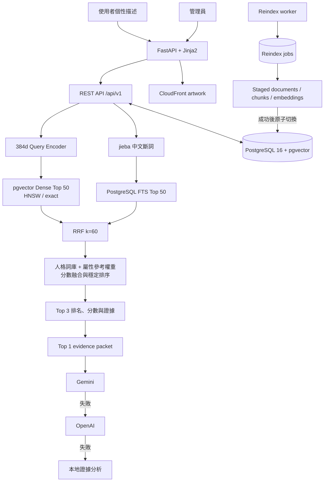

# Pokémon Personality Recommender

> 輸入一段個性、興趣或生活方式描述，從 1,025 隻寶可夢中找出最契合的人格夥伴，並以可追蹤的圖鑑證據產生繁體中文分析。

[](https://github.com/likaisuwork9616/pokemon-personality-recommender/actions/workflows/ci.yml)


這是一套以 FastAPI、PostgreSQL 與 pgvector 建立的 Hybrid Retrieval／Grounded RAG 專案。推薦排名由語意檢索、中文全文搜尋、SQL 人格詞庫與寶可夢屬性參考權重共同決定；LLM 只負責將既有排名與證據整理成說明，不參與改寫名次。

目前以本機 Docker Compose 作為完整展示環境。推薦頁聚焦 Top 1，Top 2／3 以精簡卡片保留供比較；REST API 仍固定回傳完整 Top 3 與各項分數。

## 功能亮點

- 以自然語言描述個性，取得穩定排序的 Top 3 寶可夢推薦。
- 首頁突出 Top 1 圖片、語意分數、人格分數、總分及契合分析，Top 2／3 收合為次要預覽。
- Dense Retrieval 使用 384 維 SentenceTransformer embeddings 與 pgvector HNSW；另保留 exact cosine search 作為效能基準。
- jieba 中文斷詞搭配 PostgreSQL Full Text Search，Dense／Lexical 各取 Top 50，再以 RRF（`k=60`）融合。
- 圖鑑敘述拆成版本化 documents 與 chunks，保存來源、語言、雜湊、current／ready 狀態及 evidence lineage。
- 16 維人格特質、繁中／英文同義詞與權重存於 PostgreSQL，管理端修改後可無須重啟立即更新。
- 18 種寶可夢屬性具有人格參考權重；主、副屬性權重會合併進後端人格計分及 Top 1 分析證據包。
- Gemini 優先產生結構化分析；失敗時改用 OpenAI，再失敗則使用本地 evidence-only fallback。
- 管理後台支援寶可夢維護、停用／恢復、人格詞庫管理、reindex 排程與進度查詢。
- Alembic 管理完整 schema，Docker Compose 可從空資料庫完成 migration、seed、embedding 與服務啟動。
- Artwork 可選擇存放於 S3、透過 CloudFront 發送，PostgreSQL 僅保存圖片 URL。

## 系統架構



CSV 僅在建立空資料庫時作為 seed 來源。應用程式啟動後，寶可夢資料、人格詞庫、知識 chunks、索引狀態與 embeddings 都直接從 PostgreSQL 讀取。

## 推薦流程

1. FastAPI 驗證輸入長度與 request schema。
2. SentenceTransformer 將描述編碼成正規化的 384 維 query vector。
3. pgvector 與中文全文搜尋各取 Top 50 chunks，再以 RRF 融合。
4. 系統按寶可夢聚合結果，每隻最多保留三段證據，避免 chunk 數量造成灌票。
5. SQL 人格詞庫將描述映射到 16 維人格訊號，並加入主、副屬性參考權重。
6. 語意與人格分數依固定規則融合，以寶可夢 ID 作為最終 tie-break，產生可重現的 Top 3。
7. 只有 Top 1 會進入 Grounded RAG；Gemini、OpenAI 或本地 fallback 均不得改變排名與分數。

總分公式：

```text
total = α × personality + (1 - α) × semantic
```

`α` 依辨識到的人格訊號調整，範圍為 `0.35–0.80`。每段證據都帶有 `document_id`、`chunk_id`、`content_hash` 與 `evidence_id`，可追溯到當次使用的知識版本。

### AI 契合分析與備援

- Web 介面預設要求 Top 1 契合分析；API 的 `generate_explanation` 預設為 `false`，呼叫端可自行決定是否啟用。
- 有設定 `GEMINI_API_KEY` 時先呼叫 Gemini；結果逾時、格式錯誤、非繁中、引用不合法或其他失敗時才嘗試 OpenAI。
- Gemini 缺少 key 或無法使用，但已設定 `OPENAI_API_KEY` 時，直接由 OpenAI 接手。
- 兩個外部服務都不可用時，系統會根據本次人格訊號、屬性權重及圖鑑證據產生本地繁中說明。
- LLM 回應必須符合結構化 schema，且只能引用該推薦結果自己的 evidence allowlist。
- OpenAI 請求明確設定 `store=false`；程式不會將模型錯誤、prompt 或原始描述寫入應用程式 log。

## 技術棧

| 類別 | 技術 |
| --- | --- |
| Web／API | FastAPI、Pydantic、Jinja2、原生 JavaScript／CSS |
| Database | PostgreSQL 16、SQLAlchemy、Alembic |
| Retrieval | pgvector、HNSW、PostgreSQL FTS、jieba、RRF |
| Embedding | SentenceTransformers `paraphrase-multilingual-MiniLM-L12-v2` |
| RAG | Google Gemini、OpenAI、結構化輸出與 citation allowlist |
| Operations | Docker Compose、背景 reindex worker、Prometheus 格式 metrics |
| Media pipeline | Amazon S3、CloudFront、SHA-256 manifest 驗證 |
| Quality | unittest、GitHub Actions、離線 retrieval evaluation、向量效能基準 |

## 快速開始

### 執行需求

- Docker Desktop 與 Docker Compose v2
- 約 4 GB 可用記憶體
- 首次啟動時可連線下載 Python packages 與 Hugging Face embedding model
- Gemini／OpenAI API key 為選配；沒有 key 時仍可使用完整排名與本地契合分析

### 1. 取得專案

```bash
git clone https://github.com/likaisuwork9616/pokemon-personality-recommender.git
cd pokemon-personality-recommender
```

建立本機環境檔：

```bash
cp .env.example .env
```

Windows PowerShell：

```powershell
Copy-Item .env.example .env
```

### 2. 設定環境變數

至少設定 PostgreSQL 密碼。若要使用管理後台，另設定管理密碼與至少 32 字元的 session secret：

```env
POSTGRES_PASSWORD=replace-with-a-strong-password
ADMIN_PASSWORD=replace-with-a-strong-admin-password
ADMIN_SESSION_SECRET=replace-with-a-random-secret-of-at-least-32-characters
ADMIN_COOKIE_SECURE=false
```

需要外部契合分析時，可設定其中一個或兩個 provider。兩者都有設定時固定以 Gemini 為第一順位：

```env
GEMINI_API_KEY=
GEMINI_MODEL=gemini-3.5-flash-lite
OPENAI_API_KEY=
OPENAI_MODEL=gpt-5-mini
```

`.env` 已被 Git 排除。請勿將資料庫密碼、管理密碼或 API key 寫入 repository。

### 3. 啟動服務

```bash
docker compose up --build -d
docker compose ps -a
```

第一次啟動會依序執行 Alembic migrations、匯入 1,025 筆 seed 資料並建立 embeddings，因此會比後續啟動久。`migrate`、`seed`、`embed` 成功後會顯示 `Exited (0)`；`db`、`api`、`worker` 會持續運行。

| 功能 | URL |
| --- | --- |
| 人格推薦 | <http://localhost:8000/> |
| 寶可夢圖鑑 | <http://localhost:8000/pokemon> |
| 管理後台 | <http://localhost:8000/admin> |
| Swagger UI | <http://localhost:8000/docs> |

停止服務：

```bash
docker compose down
```

此指令會保留 PostgreSQL 與模型 volumes。完整環境變數、資料庫查驗、worker 維護及量測指令請參考 [本機操作指南](docs/operations.md)；圖片上傳與 CDN URL 切換另見 [AWS artwork 發送流程](docs/aws-artwork.md)。

## API

### 公開介面

| Method | Path | 說明 |
| --- | --- | --- |
| `POST` | `/api/v1/recommendations` | 回傳 Top 3；僅 Top 1 可包含契合分析 |
| `GET` | `/api/v1/pokemon` | 中英文搜尋、分頁、屬性、世代及特殊分類篩選 |
| `GET` | `/api/v1/pokemon/{pokemon_id}` | 取得單一寶可夢的繁中圖鑑資料 |
| `GET` | `/api/v1/personality/traits` | 取得公開的人格特質與加權詞彙 |

範例：

```bash
curl --request POST http://localhost:8000/api/v1/recommendations \
  --header "Content-Type: application/json" \
  --data '{"text":"我慢熟但重視承諾，也喜歡和別人分享自己喜歡的事物。","generate_explanation":true}'
```

每筆結果包含寶可夢基本資料、圖片 URL、`semantic`／`personality`／`total` 分數及 evidence lineage；`results[0]` 另包含選配的繁中契合分析。完整 request／response schema 以 Swagger UI 為準。

### 管理介面

管理 API 位於 `/api/v1/admin/*`，提供：

- 單一管理員 session 登入與登出
- 寶可夢新增、查看、修改、停用與恢復
- index status、reindex 排程與工作進度
- 人格特質及同義詞的新增、修改、加權、停用與恢復

管理 session 使用簽章 HttpOnly cookie、`SameSite=Strict` 與 CSRF token。未設定管理密碼或 session secret 時管理登入會停用；公開圖鑑排除 inactive Pokémon，推薦流程只使用 current、ready 的知識與 embeddings。

## 資料庫與重新索引

Docker Compose 的資料初始化順序為：

```text
db → migrate → seed → embed → api
                           └→ worker
```

- `migrate`：將 Alembic schema 升級到最新版本並啟用 pgvector。
- `seed`：將 CSV 完整 upsert 至關聯式資料表，重跑不會重複建立資料。
- `embed`：為尚未建立向量的 current chunks 補齊 embeddings。
- `worker`：領取 PostgreSQL reindex jobs，建立 staged 文件與向量，全部成功後才原子切換 current index。

修改圖鑑內容後，舊索引會繼續服務，直到新版文件、chunks 與 embeddings 全部 ready；失敗工作保留狀態並可重試，不會留下半套 current index。

確認執行期資料來自 PostgreSQL：

```bash
docker compose exec db psql -U pokemon -d pokemon -c "SELECT COUNT(*) FROM pokemon;"
docker compose exec db psql -U pokemon -d pokemon -c "SELECT COUNT(*) FROM pokemon_chunk_embeddings WHERE status = 'ready';"
```

API 執行期不會讀取 CSV；移除或更名 CSV 不影響已完成初始化的資料庫服務，但會影響日後從空資料庫重新 seed。

## 隱私與安全設計

- 原始個性描述與 query vector 僅存在 request scope，不寫入 PostgreSQL、應用程式 log 或瀏覽器儲存空間。
- `generate_explanation=false` 時不呼叫任何外部 LLM。
- 啟用外部分析時，原始描述與當次 evidence packet 會送至 Gemini；若 Gemini 失敗且 OpenAI key 已設定，亦可能送至 OpenAI。
- Provider 錯誤訊息可能含有 prompt，因此只在內部觸發下一層 fallback，不向 API 或 log 暴露。
- LLM 只能解釋既有證據，不能改變排名、分數或引用其他寶可夢的資料。
- `.env`、圖片、上傳 manifest、資料庫備份、快取與本機開發藍圖都由 `.gitignore` 排除。

## 測試與評估

GitHub Actions 使用 Python 3.12 與暫時的 pgvector PostgreSQL 執行 migrations 和完整測試：

```bash
python -m unittest discover -s tests -v
```

目前共有 186 個測試案例。本機未設定可丟棄的 `TEST_DATABASE_URL` 時，結果為 185 通過、1 略過；CI 提供獨立 PostgreSQL 後會執行 importer 整合測試。

測試範圍包含 API schema、隱私、Hybrid Retrieval、RRF、人格與屬性權重、provider failover、圖鑑在地化、管理驗證、reindex 原子切換、migration、圖片 manifest 及效能統計。

### pgvector 查詢基準

以下為 2026-09-07 的單一本機開發環境快照：4,684 個 ready vectors、50 次 Top-50 查詢、`ef_search=100`。

| 模式 | Mean | p50 | p95 | QPS |
| --- | ---: | ---: | ---: | ---: |
| Exact | 5.11 ms | 4.69 ms | 6.92 ms | 195.51 |
| HNSW | 1.99 ms | 1.88 ms | 3.19 ms | 503.45 |

HNSW 平均 Recall@50 為 99.64%，最低單次 Recall@50 為 92%。結果會受到硬體、資料量與 PostgreSQL cache 影響，不代表正式環境的效能保證。

### 離線推薦基準

目前評估集只有 5 筆人工標註，主要用來驗證 evaluation pipeline 與追蹤 ranking regression，不能推論正式推薦品質。

| 指標 | 結果 |
| --- | ---: |
| Retrieval Recall@10 | 0.20 |
| MRR@10 | 0.15 |
| nDCG@10 | 0.1391 |
| Top-3 Hit Rate | 0.20 |
| Precision@3 | 0.0667 |
| 平均延遲 | 287.63 ms |

重跑 benchmark、設定品質門檻及使用可丟棄整合資料庫的方法，請參考 [本機操作指南](docs/operations.md)。

## 專案結構

```text
.
├── .github/workflows/       # GitHub Actions CI
├── app/
│   ├── api/                 # 公開與管理 REST API
│   ├── data/                # 繁中 metadata 對照表
│   ├── db/                  # SQLAlchemy models 與 session
│   ├── repositories/        # PostgreSQL／pgvector 資料存取
│   ├── schemas/             # Pydantic request／response contracts
│   ├── services/            # retrieval、scoring、RAG、reindex、observability
│   ├── static/              # 原生 JavaScript 與 CSS
│   ├── templates/           # Jinja2 頁面
│   └── main.py              # FastAPI application factory
├── alembic/                 # 版本化 schema migrations
├── docs/                    # 本機操作與 AWS 圖片流程
├── evaluation/              # 版本化離線推薦標註集
├── pokemon_descript/        # 1,025 筆初始 seed 資料
├── scripts/                 # import、embedding、worker、evaluation、AWS 工具
├── tests/                   # 單元、契約及 PostgreSQL 整合測試
├── Dockerfile
├── docker-compose.yml
├── alembic.ini
├── requirements.txt
└── requirements-aws.txt
```

## 已知限制

- 目前以本機 Docker Compose 為主要執行環境，未提供公開 HTTPS 部署。
- 離線評估集只有 5 筆標註；在據此調整排名前，仍需擴充案例與相關性標籤。
- 管理後台採單一密碼，沒有多使用者角色、操作審核或 audit log。
- `/health/ready` 會檢查推薦引擎與人格詞庫快照，但尚未在每次探測時執行即時 DB round-trip。
- `/metrics` 是 process-local 記憶體統計，程序重啟後歸零，也尚未接上 Prometheus／Grafana。
- 目前沒有 Cross-Encoder reranker；是否加入應由擴充後的評估集與延遲量測決定。

## 資料與權利聲明

- 選配的 AWS pipeline 使用本機整理自 [寶可夢官方圖鑑](https://tw.portal-pokemon.com/play/pokedex/) 的 artwork；圖片檔與上傳 manifest 不納入 repository。
- 本 repository 目前未附開源授權條款；若要允許他人使用、修改或散布，應先新增合適的 `LICENSE`。

本專案供非商業、教育與作品集展示使用。Pokémon、寶可夢名稱及相關圖像的商標與著作權屬其各自權利人所有；本專案與 Nintendo、Creatures Inc.、GAME FREAK Inc. 或 The Pokémon Company 無官方關聯。
