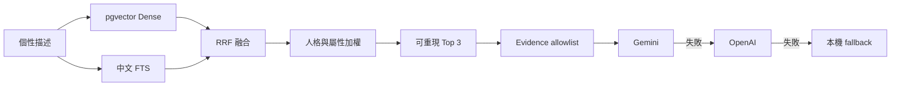

<div align="center">

# Pokémon Personality Recommender

**輸入一段個性描述，從 1,025 隻寶可夢中找出最契合、可追溯理由的 Top 3。**

[](https://github.com/likaisuwork9616/pokemon-personality-recommender/actions/workflows/ci.yml)


[快速開始](#快速開始) · [公開給別人使用](#公開給別人使用) · [系統如何運作](#系統如何運作) · [API](#api-快速範例) · [完整文件](docs/README.md)

</div>

> [!NOTE]
> 本專案是非官方、非商業的教育與作品集專案，不是心理診斷工具，也與 Nintendo、Creatures Inc.、GAME FREAK Inc. 或 The Pokémon Company 無官方關聯。

## 這個專案能做什麼

- **人格推薦**：以自然語言描述個性、興趣或生活方式，取得穩定排序的 Top 3。
- **可追溯解說**：每個結果保留 evidence lineage；外部模型只能整理已選出的證據，不能改排名。
- **今日寶可夢**：依台北時間、國農曆、節氣、時辰與星座產生可重現的娛樂性每日匹配。
- **完整圖鑑**：提供繁中搜尋、分頁、屬性、世代與特殊分類篩選。
- **可維護後台**：支援 `viewer / editor / admin`、Audit Log、人格詞庫與安全 reindex。
- **可正式營運**：包含 PostgreSQL backup／restore、Prometheus、Grafana、Alertmanager、Caddy HTTPS、rate limit 與 immutable image rollback。

推薦排序與文字生成彼此分離。即使沒有 Gemini／OpenAI key，Top 3、圖鑑證據與本機繁中契合分析仍可使用。

## 快速開始

### 需求

- Docker Desktop 或 Docker Engine
- Docker Compose v2
- 約 4 GB 可用記憶體
- 首次啟動時可下載 Python packages 與 Hugging Face embedding model

### 1. 取得專案與環境檔

```bash
git clone https://github.com/likaisuwork9616/pokemon-personality-recommender.git
cd pokemon-personality-recommender
cp .env.example .env
```

Windows PowerShell 請用：

```powershell
Copy-Item .env.example .env
```

### 2. 設定本機密碼

至少修改 `.env` 內這兩項：

```env
POSTGRES_PASSWORD=replace-with-a-strong-database-password
GRAFANA_ADMIN_PASSWORD=replace-with-a-strong-grafana-password
```

要啟用管理後台，再設定：

```env
ADMIN_PASSWORD=replace-with-a-strong-admin-password
ADMIN_SESSION_SECRET=replace-with-at-least-32-random-characters
ADMIN_COOKIE_SECURE=false
```

`GEMINI_API_KEY`、`OPENAI_API_KEY` 都是選配。第一次啟動建議先保持空白，確認本機 fallback 正常後，再依[費用護欄](docs/cost-controls.md)設定專案預算與告警。

> [!WARNING]
> `.env` 已由 Git 排除。不要把資料庫密碼、管理密碼、API key、帳號 ID 或通知 webhook 提交到 repository。

### 3. 啟動

```bash
docker compose up --build --detach
docker compose ps --all
```

第一次啟動會依序執行：

```text
Migration → 1,025 筆 seed → embeddings → API / worker / monitoring
```

`migrate`、`seed`、`embed` 完成後顯示 `Exited (0)`；其餘服務維持運行。確認 API ready：

```bash
curl http://localhost:8000/health/ready
```

Windows PowerShell 可使用：

```powershell
Invoke-RestMethod http://localhost:8000/health/ready
```

### 本機入口

| 功能 | URL |
| --- | --- |
| 人格推薦 | <http://localhost:8000/> |
| 今日寶可夢 | <http://localhost:8000/today> |
| 寶可夢圖鑑 | <http://localhost:8000/pokemon> |
| 管理後台 | <http://localhost:8000/admin> |
| OpenAPI／Swagger | <http://localhost:8000/docs> |
| Prometheus | <http://localhost:9090> |
| Grafana | <http://localhost:3000> |
| Alertmanager | <http://localhost:9093> |

上述 ports 在本機 Compose 都只綁 `127.0.0.1`。

停止服務：

```bash
docker compose down
```

這會保留所有 named volumes。不要加 `--volumes`，除非已確認 PostgreSQL、模型快取與監控歷史都可以刪除。

更多環境變數、log、資料庫與 reindex 操作請看[本機操作指南](docs/operations.md)。

## 公開給別人使用

`localhost`／`127.0.0.1` 只有你自己的電腦能開。專案提供兩種公開方式：

| 用途 | 方式 | 特性 |
| --- | --- | --- |
| 短時間請朋友測試 | Cloudflare Quick Tunnel | 不必開路由器 port；網址隨機、電腦與 Docker 必須保持運行 |
| 長期固定公開 | Linux 主機＋網域＋Caddy | 固定網址、HTTPS、備份、告警與 rollback；需要主機及 DNS |

### 臨時分享

依照 [Quick Tunnel 步驟](docs/production.md#臨時-cloudflare-quick-tunnel-smoke-test)啟動後，log 會出現：

```text
https://random-words.trycloudflare.com
```

把該網址傳給別人即可。流量會先經過 repository 內受測試的 Caddy 邊界，再到 API；Gemini、OpenAI、HF keys 會被強制清空。測試完成就關閉 tunnel，因為 Quick Tunnel 沒有固定網址或 uptime 保證。

### 長期公開

請先準備自己可承擔流量的 artwork 來源、Linux 主機、網域、GitHub protected Environment、Alertmanager receiver 與 off-host backup，再依[正式環境部署文件](docs/production.md)上線。Production Compose 只公開 Caddy 80／443；PostgreSQL 不發布 host port，Prometheus／Grafana／Alertmanager 只綁 loopback。

## 系統如何運作


```mermaid
flowchart LR
    INPUT[個性描述] --> DENSE[pgvector Dense]
    INPUT --> FTS[中文 FTS]
    DENSE --> RRF[RRF 融合]
    FTS --> RRF
    RRF --> SCORE[人格與屬性加權]
    SCORE --> TOP3[可重現 Top 3]
    TOP3 --> EVIDENCE[Evidence allowlist]
    EVIDENCE --> GEMINI[Gemini]
    GEMINI -->|失敗| OPENAI[OpenAI]
    OPENAI -->|失敗| LOCAL[本機 fallback]
```

核心流程：

1. SentenceTransformer 建立 384 維 query vector。
2. pgvector Dense Retrieval 與 jieba／PostgreSQL FTS 各自取候選。
3. RRF 融合後，加入 16 維人格訊號與寶可夢屬性參考權重。
4. 以固定 tie-break 產生 Top 3；只有 Top 1 進入解說流程。
5. Gemini、OpenAI 或本機 fallback 都只能引用該結果的 evidence，不能改排名與分數。

完整資料流、分數公式、今日寶可夢與 reindex 設計見[系統架構與推薦流程](docs/architecture.md)。

## API 快速範例

以下範例不要求外部 AI 解說，因此不會呼叫 Gemini／OpenAI。Windows PowerShell 請把 `curl` 改成 `curl.exe`。

```bash
curl --request POST http://localhost:8000/api/v1/recommendations \
  --header "Content-Type: application/json" \
  --data '{
    "text": "我慢熟但重視承諾，也喜歡幫助朋友。",
    "generate_explanation": false
  }'
```

常用公開端點：

| Method | Path | 說明 |
| --- | --- | --- |
| `POST` | `/api/v1/recommendations` | Top 3 排名、分數與證據；選配 Top 1 解說 |
| `GET` | `/api/v1/today-pokemon?zodiac=leo` | 今日代表寶可夢與娛樂運勢 |
| `POST` | `/api/v1/recommendation-feedback` | 以匿名收據提交 bounded feedback |
| `GET` | `/api/v1/pokemon` | 搜尋及瀏覽圖鑑 |
| `GET` | `/api/v1/pokemon/{pokemon_id}` | 單一寶可夢詳細資料 |
| `GET` | `/api/v1/personality/traits` | 公開人格詞彙與版本 |

Web 人格推薦與今日寶可夢會要求 grounded 解說；如果伺服器設定了 provider key，可能產生付費 API 呼叫。所有 schema 以啟動後的 [Swagger UI](http://localhost:8000/docs) 為準。

## 安全、隱私與成本

- 原始個性描述與 query vector 只存在 request scope，不寫入 PostgreSQL、log 或瀏覽器儲存空間。
- 匿名回饋只保存 recommendation UUID、演算法版本、Top 3 ID／名次與固定列舉。
- 公開推薦預設每來源每分鐘 10 次；要求解說時，另有每來源每 10 分鐘 3 次及單一 API 程序每 10 分鐘 20 次上限。
- 來源識別只以程序內隨機金鑰雜湊保存。未來若增加 API replicas，還需要 edge 或共享儲存層的跨程序限制。
- OpenAI 請求設定 `store=false`；provider 錯誤不向 response 或 log 暴露 prompt。
- Production 只讓 Caddy 對外；公開 `/metrics` 回傳 404，request body 上限為 16 KB。
- 備份會先驗證 archive、建立 checksum，再原子發布；restore 需要明確確認參數。
- Prometheus／Alertmanager 規則會監看 5xx、latency、readiness、429 與 provider failure，但雲端帳號仍須另設預算。

細節請看[費用護欄與主動告警](docs/cost-controls.md)、[正式部署](docs/production.md)及[推薦回饋隱私](docs/recommendation-feedback.md)。

## 測試與品質

先依[本機操作指南](docs/operations.md#從主機執行-python-工具)建立 Python 3.12 環境，再執行：

```bash
python -m unittest discover -s tests -v
```

CI 會使用 PostgreSQL 16／pgvector 執行 migration 與完整測試。Repository 另包含：

- 20 題、1–3 級相關性標註的離線評估集
- 多人獨立標註、衝突仲裁、weighted kappa 與 slice metrics
- Exact／HNSW recall、latency、QPS benchmark
- Cross-Encoder 品質與延遲 gate；目前預設關閉
- 真實 PostgreSQL readiness 故障與恢復驗證
- Production Compose 暴露面、Caddy 邊界與 Quick Tunnel smoke test

評估工作流請看[多人標註與評估資料集流程](docs/evaluation-workflow.md)。

## 專案結構

```text
.
├── app/                    # FastAPI、Web、API、retrieval、RAG
├── alembic/                # PostgreSQL schema migrations
├── docs/                   # 架構、操作、部署、安全與 roadmap
├── evaluation/             # 版本化評估資料與 benchmark 結果
├── ops/                    # Caddy、Prometheus、Grafana、Alertmanager、systemd
├── pokemon_descript/       # 1,025 筆空資料庫 seed
├── scripts/                # Import、embedding、評估、AWS 與 production 工具
├── tests/                  # 單元、契約與 PostgreSQL 整合測試
├── docker-compose.yml      # 本機完整環境
├── compose.production.yml # 正式環境
└── compose.quick-tunnel.yml
```

所有文件都可從 [docs/README.md](docs/README.md) 依使用情境進入；尚未完成的外部部署與資料累積工作列在 [Roadmap](docs/roadmap.md)。

## 圖片、資料與權利

- 本機 Compose 預設使用本專案目前的 CloudFront artwork 目錄；fork 或正式部署前，請改成自己擁有或已核准、且能承擔流量的來源。
- Production 強制要求明確設定 `POKEMON_ARTWORK_BASE_URL`，不會默默繼承專案 CloudFront。
- 圖片載入失敗時顯示本機 placeholder，不會再向未納入稽核的第三方 sprite host fallback。
- `scripts/audit_artwork_delivery.py` 可核對 1,025 筆官方來源 URL、本機 SHA-256、既有 S3／CloudFront 紀錄與線上抽樣；這只證明來源鏈與 delivery 完整性，不代表取得重製、公開傳輸或商業使用授權。
- 詳細流程與停用／替換方式見 [AWS artwork 發送流程](docs/aws-artwork.md)。

本 repository 目前沒有附開源 `LICENSE`；在專案所有者選定授權前，請勿假設可以自由使用、修改或散布程式碼。Pokémon、寶可夢名稱、商標及相關圖像的權利屬其各自權利人所有；公開頁面必須保留非官方、非商業聲明。
